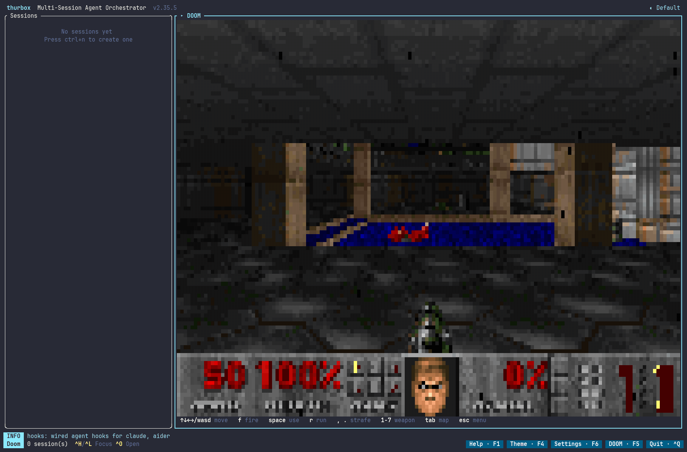

# thurbox-doom

DOOM in a thurbox pane. One Lua file asks the kernel for a program pane, frames it
and owns the key rules; the kernel runs the program in a real terminal, resizes it to
the rect and parses its output into cells. The plugin never sees a frame.

**Everything it needs ships with it, DOOM included.**
`thurbox-cli plugin install git+…` clones this repository into your interface
directory, which brings the pane, a built engine and a freely-redistributable WAD.
Grant the pane one capability and it plays: nothing to configure, nothing to fetch.

```text
<interface dir>/thurbox-doom/plugins/40_doom.lua           the pane
<interface dir>/thurbox-doom/engine/bin/linux-x86_64/doom  DOOM, statically linked
<interface dir>/thurbox-doom/wad/doom1.wad                 the WAD (Freedoom beside it)
```

The binary is **linux-x86_64** only — the one target that could be built *and run*
where this was written. On any other machine the pane names it and points at
`engine/src`, which is a `make` away, or at the `doom.program` setting.



Validated with **[thurbox v2.35.3](https://github.com/Thurbeen/thurbox/releases/tag/v2.35.3)**
on Linux x86_64. The released v2 interface supports cloned plugins, the
`program` capability and manifest-named panes. The plugin asks for an interactive
program grant because it passes your keys to the game.

The released Shell and Sessions actions use `F8` and `F9`; `F12` is reserved by
the kernel. DOOM opens with **`F5`**. The bindings load without a collision in
v2.35.3. The engine binary is built for Linux x86_64;
other platforms need a compatible terminal engine configured in `doom.program`.

## What it does

- **No engine for this platform** → a panel showing the bundled WAD and how to
  build or name a compatible engine.
- **Named but not trusted** → what it would run, and how to grant the capability.
- **Trusted** → it asks for its pane every frame and frames the surface, with a
  controls row underneath.
- **Released** (`ctrl+alt+x`) → the program is stopped and the pane given up, with the
  chord that starts it again.

No session is involved: the pane belongs to the plugin, so there is one DOOM whatever
session is selected, and none is required. Nothing is persisted — the kernel re-finds
the pane by its window name, and `F10` leaves the game running.

There is **no `agents.toml` entry**. An earlier version of this plugin created a
session whose "agent" was DOOM, which is a game pretending to be a coding agent to
borrow the one field of the session model that spawns a pty. The kernel now lends a
plugin its own pane, so that is gone.

## Finding it

`center` is a **switch** slot, so this pane is an alternate behind the agent: it draws
nothing until it is focused. Install it, launch thurbox and you will see the agent pane
— which is why the plugin advertises itself three ways:

- a **DOOM** entry in the action band along the bottom;
- **`f5`** from anywhere (rebindable, and it appears in `F1` help). **The same key takes
  you back**: pressed while the pane has focus it returns to whatever you were in
  before, so one key is both the way in and the way out;
- the focus ring — `ctrl+h` / `ctrl+l` — if you would rather walk.

**`Esc` is not the way out while the game is running**, and that is deliberate on both
sides: the kernel treats a keystroke as consumed when it actually reaches a program, so a
live DOOM takes `Esc` for its own menu and focus stays put. On the panels above — where
there is nothing behind the pane — `Esc` finds no target and leaves, which is the kernel's
normal "dismiss this pane". So: `Esc` for DOOM's menu, `f5` to leave.

Reported by someone who installed it cold and saw an empty-looking interface, which is
the failure worth avoiding: "installed correctly and appears to have done nothing".

If you would rather have DOOM beside the agent instead of taking turns with it, give
the pane a slot of its own and place that slot in `layout.lua` — two lines, and
`thurbox-cli plugin check` prints the one you need.

## The engine

`engine/` is DOOM, built for this pane, **plus the complete source it was built
from** — which is what GPL-2.0 obliges anyone shipping a binary to provide.
`engine/README.md` carries the provenance, checksums and rebuild recipe; the short
version:

| | |
|---|---|
| binary | `engine/bin/linux-x86_64/doom`, 1.5 MB, statically linked — no runtime, no shared libraries |
| source | [doomgeneric](https://github.com/ozkl/doomgeneric) at `dcb7a8d`, unmodified, plus `doomgeneric_thurbox.c` |
| rebuild | `cd engine/src && make` — a C compiler and `make`, nothing else |
| licence | **GPL-2.0** (`engine/LICENSE`). The pane is MIT; the WAD is Freedoom's BSD |

Three things its frontend does deliberately, because a pane is not a terminal
emulator:

- **It paints cells.** One `▀` per character, top pixel in the foreground and bottom
  in the background at 24-bit colour — two vertical pixels per cell. A surface
  carries *characters*, so a port using a terminal graphics protocol (Kitty
  graphics, Sixel) would have nothing to be parsed into.
- **It diffs frames.** Only cells whose colour changed are emitted, in runs, inside
  synchronised-output markers. Measured against a full-repaint port on the same WAD
  and terminal size: **~11 KB a frame rather than ~53 KB**, about 0.7 MB/s rather
  than 3.7.
- **It synthesises key releases from timing**, which is what makes held keys usable
  here at all — see [Held keys](#held-keys-and-why-this-engine-handles-them).

You are not stuck with it: point `doom.program` at any DOOM that paints text cells
and reads its keys from stdin, and the pane frames that instead. A relative path
resolves inside this plugin's clone, so a build of your own at
`engine/bin/<os>-<arch>/doom` needs no setting at all.

## The WADs, both of which ship here

```text
wad/doom1.wad          DOOM shareware — "Knee-Deep in the Dead", the default
wad/freedoom1.wad      Freedoom: Phase 1 — the freely-licensed alternative
wad/NOTICE.md          what each is, its provenance and its terms
```

**`doom1.wad` is the default** because it is DOOM as people remember it. It is id
Software's shareware episode, unmodified: 4,196,020 bytes, md5
`f0cefca49926d00903cf57551d901abe` — the canonical v1.9 shareware WAD — extracted from
`doom19s.zip` in the idgames archive, id's own multi-volume installer. `DOOM1-README.txt`
is the README that came with it. Its terms are **id's**, not an open licence: the
shareware episode was released for free redistribution in unmodified form, which is what
this is.

**`freedoom1.wad` is there for anyone who would rather rely on a licence than a
permission.** Freedoom Phase 1, 0.13.0, sha256 `7323bcc1…f9e703d`, verified against
Freedoom's published `CHECKSUM` manifest, under a **modified BSD** licence whose terms
require `COPYING.txt` and `CREDITS.txt` to travel with it — which is why they are there
and must stay.

Switching is one setting:

```text
doom.wad = wad/freedoom1.wad
```

Or point it at any IWAD you own — `doom.wad`, `doom2.wad`, `plutonia.wad`. A commercial
WAD you bought is yours; shipping one would be somebody else's problem, which is why
neither is here.

## Install

The WAD is why this is installed by **cloning** rather than fetched file by file: the
file-by-file path decodes what it fetches as UTF-8, so a WAD through it would be
silently corrupted rather than refused.

```bash
thurbox-cli plugin install git+https://github.com/Thurbeen/thurbox-doom
```

A `git+` prefix, a `.git` suffix or `git@host:path` are the three forms that clone; a
bare `https://…` deliberately does not, because that spelling already means "fetch the
files this manifest names from this base".

The working copy lands at `<interface dir>/thurbox-doom/` and **keeps its `.git`**,
which is what makes `thurbox-cli plugin update` a fetch and what protects your edits:
git will not move a dirty working tree, so a `sync` over a pane you changed reports
`kept`, and `git diff` shows what you did. The entry recorded is:

```toml
[[plugin]]
src  = "git+https://github.com/Thurbeen/thurbox-doom"
file = "thurbox-doom/plugins/40_doom.lua"
```

`install` finds that pane itself: `plugin.toml` names it (`pane.source`), and failing a
manifest it takes the single `.lua` under `plugins/`. The lock records the **commit**,
not the branch, so the same spec and lock reproduce the same bytes elsewhere. Load
order still comes from the `40_` prefix.

> **`thurbox-cli plugin install doom` does not install this.** A bare name resolves
> into the thurbox repository's own examples, where a smaller `doom` pane demonstrates
> the capability.

**What cloning means, plainly:** it puts this repository's files on your disk,
including the Linux engine binary and both WADs. Installing does not run the
engine; granting the `program` capability lets the pane start it.

`~/.config/thurbox/ui/` is the interface directory, watched, so the pane appears on
save (120 ms debounce); `F10` forces a reload. `THURBOX_UI_DIR` overrides the path, and
a dev build (`0.0.0-dev`) reads `~/.config/thurbox-dev/ui` instead.

The pane declares `slot = "center"`, which the stock `layout.lua` always places, so
**there is no arrangement edit to make** and `thurbox-cli plugin check` — which fails a
pane whose slot nothing places — has nothing to complain about. The cost is that DOOM
and the agent take turns in the centre; give the pane a slot of its own if you would
rather have both.

**If you build an engine yourself, build it somewhere else.** Two reasons, both about
this directory: it is watched recursively, so a package manager running under it fires
thousands of events and — counter-intuitively — the interface stops reloading rather
than reloading too often, because a burst keeps the debounce rolling forward. And
anything you generate inside the clone makes the tree dirty, which is exactly what
makes `update` report `kept` and refuse to move. A cache under
`${XDG_CACHE_HOME:-~/.cache}` costs nothing and avoids both.

## Trust it

The pane draws a panel until you grant the capability:

```text
settings (ctrl+, or F6) → ] to the Interface tab → select the file → t
```

`program` is a **different grant from `run`**, deliberately. `run` is bounded on every
axis that matters — capped output, a timeout, four at a time — and an interactive
program has none of those and holds your keyboard as well. Trusting a pane to poll
`top` is not the same decision as letting it hold a process open on your keystrokes.

Installing grants nothing. Nothing starts until you say `t`.

## Settings

Declared as data, so they appear in the settings modal and are stored in
`~/.config/thurbox/ui.json`.

| Setting | Default | What it does |
|---|---|---|
| `doom.program` | *(empty → the shipped engine)* | the DOOM to run. Empty resolves to `engine/bin/<os>-<arch>/doom` inside this clone, which exists for `linux-x86_64`; on a machine with no shipped build the pane says so. A relative path resolves in the clone, an absolute one is used as given |
| `doom.wad` | `wad/doom1.wad` | WAD, passed as the **last** argument. A **relative** path resolves inside this plugin's clone, so the default is the shareware episode shipped with it; `wad/freedoom1.wad` is the free alternative, and an absolute path is used as given |
| `doom.args` | `-iwad` | arguments **before** the WAD, split on spaces. The shipped engine requires `-iwad`; clear it if your own port takes a positional WAD |
| `doom.footer` | `true` | draw the controls row (it costs the game one row) |

`program` is empty in the modal rather than pre-filled with a path, because what it
resolves to depends on the machine: the pane asks `thurbox.platform` and looks for the
build this repository ships for that `os-arch`. It knows which ones were committed, so
it never exec's a path it has no reason to believe in — on an unshipped platform it
names the machine and offers the two ways forward. The WAD default names the
bundled shareware episode; Freedoom also ships in `wad/`.

The pane wraps those paths over up to three rows, then keeps both ends when a
path is longer. That preserves the filename in a long interface directory.

**Paths.** A relative `wad` resolves inside this plugin's clone
(`<interface dir>/thurbox-doom/`), which is where its own files are. Everything else
wants an absolute path: a program pane has no session and therefore no repository, so
the kernel runs the program in the interface directory, and a relative `program` would
resolve against `~/.config/thurbox/ui/` rather than where you meant.

**Why `wad` is separate from `args`.** Arguments are passed as a list and quoted
individually, so a WAD path containing a space survives as one argument. `args` is
split on whitespace for flags; the path that must not be split has its own field. The
default `-iwad` is the shipped engine's requirement, not decoration: without the flag
it searches the working directory for a handful of well-known WAD names, finds none,
and exits with `Game mode indeterminate`.

## Controls

Everything the plugin does not claim goes to the program, because it declares
`input = "session"`.

| Action | Keys |
|---|---|
| move | `↑` `↓` `←` `→`, or `w` `a` `s` `d` |
| turn | `q` `e` |
| fire | `f`, or any `ctrl` chord |
| use / open | `space` |
| run | `r` |
| strafe | `,` `.` |
| weapons | `1`–`7` |
| automap | `tab` |
| menu | `esc` — DOOM's own; it does not leave the pane |

Those are the shipped engine's, and they are DOOM's own where a terminal can express
them plus substitutes where it cannot: nothing can see a bare `shift` or `ctrl` held
down, so `r` runs and `f` fires. A `program` of your own will have its own map.

| Chord | Does |
|---|---|
| `f5` | show the DOOM pane, or leave it if it already has focus (global) |
| `ctrl+alt+r` | restart DOOM in this pane |
| `ctrl+alt+x` | stop it and give up the pane |

`f5` is global, so it reaches a pane you cannot yet see; the other two are
plugin-scoped and fire only while this pane has focus. All three are rebindable
(`~/.config/thurbox/ui.json`). The pane-scoped two are `ctrl+alt+`
chords because a declared chord is consumed before the surface ever sees it, and DOOM
wants every bare key there is — the letters included, for cheats.

### Held keys, the repeat delay, and the one number that matters

thurbox **cannot deliver key-release events** — a kernel limitation with two causes, both
confirmed upstream: the terminal layer asks for `DISAMBIGUATE_ESCAPE_CODES` and never
`REPORT_EVENT_TYPES`, and the event loop matches `KeyEventKind::Press`. It is recorded there
as **D12**. So "held" has to be inferred from auto-repeat, and that inference has a trap in
it worth understanding, because you will feel it before you read this.

Two different silences mean opposite things:

```text
repeat delay     500-660 ms   before the FIRST repeat  (GNOME 500, KDE 600, X11 660)
repeat interval    25-40 ms   between repeats after it
```

A release window shorter than the delay drops a held key half a second into every press —
move, stall, move — which reads as lag and is not. A window longer than the delay makes a
*tap* carry you for its whole length. One number cannot serve both, so the engine uses two:

- **before any repeat is seen for a key**, the window is `-release` (default **700 ms**,
  which clears every common delay above);
- **once repeats arrive**, their interval is measured and the window collapses to twice it
  (~100 ms), so letting go stops you promptly.

The cost is one long first tap per key per session — after that the rate is known and taps
release in ~100 ms too. `engine/src/release_test.c` asserts all of it against a fake clock
(`cd engine/src && make test`), including the case that made this necessary: a 600 ms delay
under a 300 ms window releases the key at 301 ms.

**If holding still feels wrong**, the honest fix is fewer milliseconds of guessing: shorten
your desktop's repeat delay, which helps every terminal program you use.

```bash
# KDE
kwriteconfig6 --file kcminputrc --group Keyboard --key RepeatDelay 200 && qdbus org.kde.KWin /KWin reconfigure
# GNOME
gsettings set org.gnome.desktop.peripherals.keyboard delay 200
# X11
xset r rate 200 30
```

With a 200 ms delay you can also drop `-release` to `250` in `doom.args` and stopping gets
sharper still. And if you point `program` at some other DOOM, ask whether it waits for real
releases: one that does will latch every key here, and no setting fixes that.

### Retracted: `tab` works

Earlier versions said `tab` was reserved by the kernel for focus, so DOOM's automap was
unreachable. That was wrong. The reserved set is `ctrl+q`, `f10`, `ctrl+h`, `ctrl+l`
and `f12`; `tab` is forwarded to the focused pane on purpose, because every coding
agent needs it for completion. **The automap works.** The kernel's own `F1` help and
`docs/PLUGINS.md` claimed otherwise; both were fixed upstream — in the commit "stop
claiming tab moves focus, because it does not" — after this plugin reported it.

## What this deliberately is not

A Lua software renderer. It is *expressible* — `surface` takes Lua-supplied styled runs
and `parse_color` accepts `#rrggbb` — but there is no way to get frames into Lua: no
WASM runtime, no ffi, no filesystem, and `run` completes rather than streams. A frame
drawn cell by cell is thousands of styled runs against a conversion path whose hottest
measured case is ~100 spans a pane (`docs/V2-KERNEL.md`). A program pane costs none of
it: the cells never pass through Lua.

The Linux engine binary ships beside its corresponding GPL source. Build output
belongs outside the watched interface directory; copy only the finished binary
into an isolated plugin copy when testing another build.

## Credits

- **id Software**, for DOOM, and for releasing its source.
- **[doomgeneric](https://github.com/ozkl/doomgeneric)** by ozkl, the portable split
  that makes a frontend this small possible: six functions and a framebuffer.
- **[Freedoom](https://freedoom.github.io/)**, for game data anyone may ship.

## Licences

This plugin is MIT (see [`LICENSE`](LICENSE)) — Copyright (c) 2026 Thurbeen, matching
`Thurbeen/thurbox`.

**`engine/` is GPL-2.0**, not MIT: it is DOOM's source and a binary built from it.
`engine/LICENSE` is the licence, and `engine/src/` is the corresponding source that
shipping a GPL binary obliges — the exact tree the committed binary was compiled from,
rather than a link to a repository that may move.

**The WADs are game data and neither is MIT.** `wad/NOTICE.md` is the full statement;
briefly: `doom1.wad` is id Software's shareware episode, redistributed unmodified under
id's terms rather than an open licence, and `freedoom1.wad` is under Freedoom's
**modified BSD**, whose conditions require `wad/COPYING.txt` and `wad/CREDITS.txt` to
accompany it — removing them would break them.

So: MIT for the pane, GPL-2.0 for the engine, and for the data one open licence and one
permission. A commercial WAD you supply yourself is your own affair.

## Demo and checks

`media/demo.gif` was recorded from the real v2.35.3 TUI and the bundled DOOM
engine. `demo/record.sh` copies the installed interface into an isolated
environment, grants only that copy, drives the pane with tmux, captures the
terminal at 200×56 cells with asciinema, and starts the first level with the
plugin's `args` setting. It keeps DOOM focused throughout gameplay, removes
the engine's temporary startup path from the cast, trims the initial pane
repaint after the HUD appears, then renders an 1818×1197 GIF at agg's native
size with ffmpeg preserving its sharp cell edges. `bash tests/demo_media.sh`
decodes the delivered GIF and checks every frame for an empty gameplay viewport.
Recreate it with:

```bash
bash demo/record.sh
```

`bash tests/smoke.sh` uses the same isolated setup. It checks the current
interface's key registry for a collision, opens DOOM with F5, and confirms that
the engine has a live program window. Before the F5 change, F8 collided with
`shell.open` and F12 opened the kernel's performance overlay instead of DOOM.

To try the installed plugin yourself: install it with the command above, run
`thurbox-cli plugin check`, grant `program` in the Interface settings tab,
press **F5**, select New Game, an episode and a skill with **Enter**, move with
the arrow keys, and press **F5** again to leave. The next F5 returns to the
running game.
