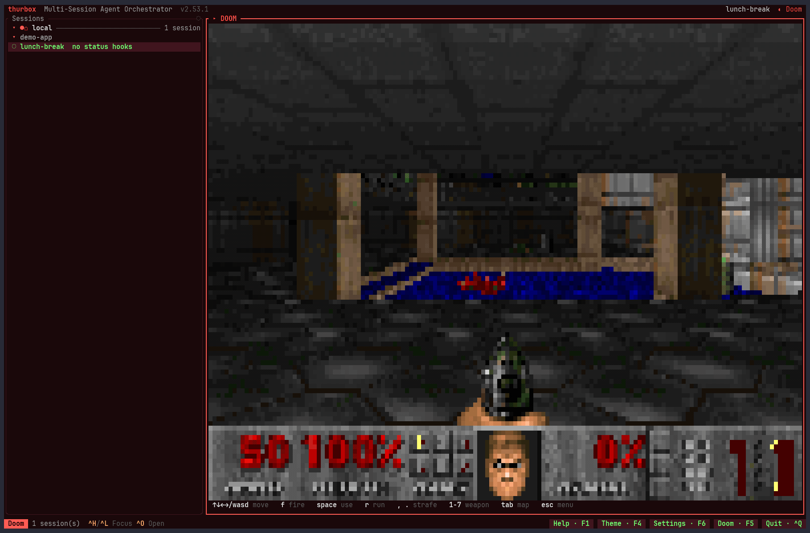
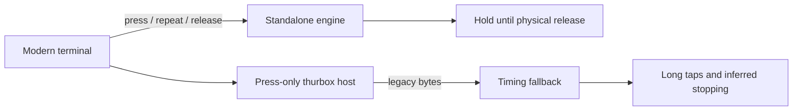
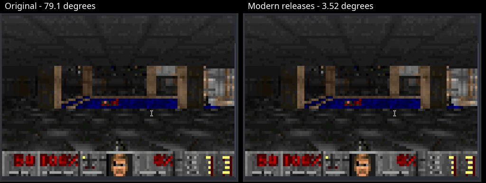

# thurbox-doom

Doom's engine, WADs, and settings for the **Doom tab** in
[thurbox-code-review](https://github.com/Thurbeen/thurbox-code-review). The agent
pane owns F5, the tab strip, and focus. It imports `lib/doom.lua` from this
package to render and control the program surface. The engine, WADs, and settings
remain here; the compatibility pane adds no visible focus stop.
Its action-band Doom entry invokes the agent pane's `doom.open` action, so it
also opens the tab instead of the old standalone pane. Without code-review
installed, the same file supplies the earlier standalone pane and F5 binding.

Install both repositories as cloned plugins:

```bash
thurbox-cli plugin install git+https://github.com/Thurbeen/thurbox-code-review
thurbox-cli plugin install git+https://github.com/Thurbeen/thurbox-doom
thurbox-cli plugin check
```

The code-review README explains how to replace the bundled agent pane. Installing
the Doom package puts its Linux x86_64 engine and WADs on disk but runs neither.
With a session selected, click **Doom** in the agent pane's strip or press **F5**.
F5 again returns to Agent. The selected tab is remembered per session.

Grant the **program** capability to `thurbox-code-review/plugins/20_agent.lua` from
`Ctrl+,` → `]` → the file → `t`. Until then, the Doom tab shows the exact command
it would run and the grant steps. Review's optional `run` capability is separate.
No settings file needs to be edited by hand.

The Doom settings remain on `thurbox-doom/plugins/40_doom.lua` in the Interface
settings tab. Existing `doom.program`, `doom.wad`, `doom.args`, and `doom.footer`
overrides continue to apply:

| Setting | Default | Purpose |
|---|---|---|
| `doom.program` | bundled Linux x86_64 engine | Relative paths resolve in the Doom clone; absolute paths are used as given. |
| `doom.wad` | `wad/doom1.wad` | The last program argument; `wad/freedoom1.wad` is also included. |
| `doom.args` | `-iwad` | Arguments before the WAD. |
| `doom.footer` | `true` | Show the controls row. |

On other platforms, the tab explains how to build an engine or configure
`doom.program`. `Ctrl+Alt+R` restarts the game; `Ctrl+Alt+X` stops it. The game
receives movement, firing, map, and menu keys while its surface is shown.



The demo is the standalone pane, recorded in thurbox's built-in Doom theme: F5,
then E1M1 and its automap. With the agent pane the program surface and game
controls are the same; only the surrounding chrome differs.
`bash demo/record.sh` re-records it against the thurbox on `PATH`, from this
repository's committed state, in a throwaway home and tmux server.

## The engine

`engine/` is DOOM, built for this pane, **plus the complete source it was built
from** — which is what GPL-2.0 obliges anyone shipping a binary to provide.
`engine/README.md` carries the provenance, checksums and rebuild recipe; the short
version:

| | |
|---|---|
| binary | `engine/bin/linux-x86_64/doom`, 1.5 MB, statically linked — no runtime, no shared libraries |
| source | [doomgeneric](https://github.com/ozkl/doomgeneric) at `dcb7a8d`, unmodified, plus `doomgeneric_thurbox.c` |
| rebuild | `cd engine/src && make` — a C compiler and `make`, nothing else |
| licence | **GPL-2.0** (`engine/LICENSE`). The pane is MIT; the WAD is Freedoom's BSD |

Three things its frontend does deliberately, because a pane is not a terminal
emulator:

- **It paints cells.** One `▀` per character, top pixel in the foreground and bottom
  in the background at 24-bit colour — two vertical pixels per cell. A surface
  carries *characters*, so a port using a terminal graphics protocol (Kitty
  graphics, Sixel) would have nothing to be parsed into.
- **It diffs frames.** Only cells whose colour changed are emitted, in runs, inside
  synchronised-output markers. Writes are nonblocking: one unfinished frame is
  retained, and new frames are skipped until it finishes, so a slow reader cannot
  stop engine ticks or input polling. Measured against a full-repaint port on the same WAD
  and terminal size: **~11 KB a frame rather than ~53 KB**, about 0.7 MB/s rather
  than 3.7.
- **It requests real key releases** using the Kitty keyboard protocol. A standalone
  modern terminal can distinguish taps from holds; press-only hosts retain the timing
  fallback — see [Keyboard input](#keyboard-input-real-releases-and-the-timing-fallback).

You are not stuck with it: point `doom.program` at any DOOM that paints text cells
and reads its keys from stdin, and the pane frames that instead. A relative path
resolves inside this plugin's clone, so a build of your own at
`engine/bin/<os>-<arch>/doom` needs no setting at all.

## The WADs, both of which ship here

```text
wad/doom1.wad          DOOM shareware — "Knee-Deep in the Dead", the default
wad/freedoom1.wad      Freedoom: Phase 1 — the freely-licensed alternative
wad/NOTICE.md          what each is, its provenance and its terms
```

**`doom1.wad` is the default** because it is DOOM as people remember it. It is id
Software's shareware episode, unmodified: 4,196,020 bytes, md5
`f0cefca49926d00903cf57551d901abe` — the canonical v1.9 shareware WAD — extracted from
`doom19s.zip` in the idgames archive, id's own multi-volume installer. `DOOM1-README.txt`
is the README that came with it. Its terms are **id's**, not an open licence: the
shareware episode was released for free redistribution in unmodified form, which is what
this is.

**`freedoom1.wad` is there for anyone who would rather rely on a licence than a
permission.** Freedoom Phase 1, 0.13.0, sha256 `7323bcc1…f9e703d`, verified against
Freedoom's published `CHECKSUM` manifest, under a **modified BSD** licence whose terms
require `COPYING.txt` and `CREDITS.txt` to travel with it — which is why they are there
and must stay.

Switching is one setting:

```text
doom.wad = wad/freedoom1.wad
```

Or point it at any IWAD you own — `doom.wad`, `doom2.wad`, `plutonia.wad`. A commercial
WAD you bought is yours; shipping one would be somebody else's problem, which is why
neither is here.

### Keyboard input: real releases and the timing fallback

The engine requests [Kitty keyboard protocol](https://sw.kovidgoyal.net/kitty/keyboard-protocol/)
flags 11: escape disambiguation, event types, and all keys. A reported key stays down
until its physical release; auto-repeat is not needed to keep it held. Partial input
sequences survive split reads. Physical aliases such as `w` and Up remain held until
both release. The terminal's previous keyboard mode is restored on normal game exit.


```mermaid
flowchart LR
  T[Modern terminal] -->|press / repeat / release| E[Standalone engine]
  E --> R[Hold until physical release]
  T --> H[Press-only thurbox host]
  H -->|legacy bytes| F[Timing fallback]
  F --> L[Long taps and inferred stopping]
```

The reference thurbox source inspected at `c8fe7d38` requests only escape disambiguation, dispatches Press,
and encodes keys without event types. Smooth held controls inside that host require
a separate host change to request and forward repeat/release events to program
surfaces. A modern outer terminal alone does not bypass this limitation. The host
checkout and the installed plugin were not changed by this engine fix.

The reported near-90° turn is expected from the old timing fallback, **not a discrete
turn binding**: one arrow press stays down for 700 ms and accumulates incremental
turn ticks. In controlled standalone tests it turned 79.1°. Shortening that timeout
interrupts holds before auto-repeat starts, so it cannot make both taps and holds
correct. Real releases remove that ambiguity.

`python3 tests/input_latency.py` runs the real engine in a local PTY with isolated
configuration and no monsters. It records input, player angle, simulation ticks,
draw calls, and changing output frames. Before modern-event support, the modern
press/release cases fail because those sequences are ignored. After the fix, one
50 ms tap turned 3.52° and released in 27 ms; a 900 ms hold without repeats stayed
down, and a longer hold with repeats had a maximum turning-tick gap of 31 ms.
Engine draw calls averaged 14.30 ms apart; changing output frames averaged 30.82 ms,
with an 85 ms maximum gap in that run. Draw calls and changing cells are different
cadences: identical cells are omitted, and DOOM's simulation advances at 35 Hz.
These measurements exclude the user's display presentation and SSH path.

An optional physical-key test, `python3 tests/ghostty_input.py`, runs Ghostty and
Xvfb on a separate virtual display, with repeat disabled there. It requires Linux,
Ghostty, Xvfb, X11/XTest libraries and ffmpeg. Ghostty **1.3.1-arch2 (tip build)**
was exercised: the same 50 ms physical arrow tap turned 79.1° with the original
engine and 3.52° with the fix, with physical release received in 9–11 ms. A 900 ms
hold continued until physical key-up; the original stopped turning near 700 ms.
The script records the comparison below and removes its temporary terminal/display.



Other engine failures were reproduced separately before fixing:

| Controlled scenario | Original frontend | Fixed frontend |
|---|---|---|
| Second hold, 600 ms initial repeat delay | releases early | stays down |
| Two Esc taps 150 ms apart | second press discarded | both menu actions arrive |
| Fire during a 350 ms output stall | arrives at 353 ms after reading resumes | 12 ms |
| Simulation during the same output stall | 0 ticks | 12 ticks |
| Tab behind 1024 buffered repeat bytes | 109 ms | 28 ms |

These are single-run measurements at 100×40 cells. A separate fixed 155×40 run
passed too. The operator reproduced similar lag over SSH in thurbox and standalone,
then locally without SSH using Windows Terminal and Ghostty. Thus SSH and thurbox
are not required to reproduce the engine symptoms. The operator's terminal versions
and Windows Terminal behavior with this fix remain unverified; no SSH delay is
inferred from these reports. Actual manual play still needs the operator's validation.

For press-only input the compatibility fallback remains: `-release` defaults to
700 ms on each hold, then shrinks to twice the learned repeat interval plus 20 ms
(with a 60 ms floor). Movement/use taps may merge; separately received presses still
reach menus and shortcuts. `make -C engine/src test` checks this fallback against a
fake clock. Startup screen wipes still suspend ordinary input polling; terminal
presentation can also lag behind engine state. Use a terminal/path that delivers
real releases for precise taps and continuous holds.

### Retracted: `tab` works

Earlier versions said `tab` was reserved by the kernel for focus, so DOOM's automap was
unreachable. That was wrong. The reserved set is `ctrl+q`, `f10`, `ctrl+h`, `ctrl+l`
and `f12`; `tab` is forwarded to the focused pane on purpose, because every coding
agent needs it for completion. **The automap works.** The kernel's own `F1` help and
`docs/PLUGINS.md` claimed otherwise; both were fixed upstream — in the commit "stop
claiming tab moves focus, because it does not" — after this plugin reported it.

## What this deliberately is not

A Lua software renderer. It is *expressible* — `surface` takes Lua-supplied styled runs
and `parse_color` accepts `#rrggbb` — but there is no way to get frames into Lua: no
WASM runtime, no ffi, no filesystem, and `run` completes rather than streams. A frame
drawn cell by cell is thousands of styled runs against a conversion path whose hottest
measured case is ~100 spans a pane (`docs/V2-KERNEL.md`). A program pane costs none of
it: the cells never pass through Lua.

The Linux engine binary ships beside its corresponding GPL source. Build output
belongs outside the watched interface directory; copy only the finished binary
into an isolated plugin copy when testing another build.

## Credits

- **id Software**, for DOOM, and for releasing its source.
- **[doomgeneric](https://github.com/ozkl/doomgeneric)** by ozkl, the portable split
  that makes a frontend this small possible: six functions and a framebuffer.
- **[Freedoom](https://freedoom.github.io/)**, for game data anyone may ship.

## Licences

This plugin is MIT (see [`LICENSE`](LICENSE)) — Copyright (c) 2026 Thurbeen, matching
`Thurbeen/thurbox`.

**`engine/` is GPL-2.0**, not MIT: it is DOOM's source and a binary built from it.
`engine/LICENSE` is the licence, and `engine/src/` is the corresponding source that
shipping a GPL binary obliges — the exact tree the committed binary was compiled from,
rather than a link to a repository that may move.

**The WADs are game data and neither is MIT.** `wad/NOTICE.md` is the full statement;
briefly: `doom1.wad` is id Software's shareware episode, redistributed unmodified under
id's terms rather than an open licence, and `freedoom1.wad` is under Freedoom's
**modified BSD**, whose conditions require `wad/COPYING.txt` and `wad/CREDITS.txt` to
accompany it — removing them would break them.

So: MIT for the pane, GPL-2.0 for the engine, and for the data one open licence and one
permission. A commercial WAD you supply yourself is your own affair.

## Checks

`bash scripts/check.sh` runs Lua formatting, engine timing and PTY input tests,
the media check, and isolated plugin loading.
The agent-pane integration is exercised by `tests/run.sh --render` in
thurbox-code-review and by `thurbox-cli plugin check` after installing both plugins.
`tests/demo_media.sh` checks that the committed demo keeps gameplay in every frame.
